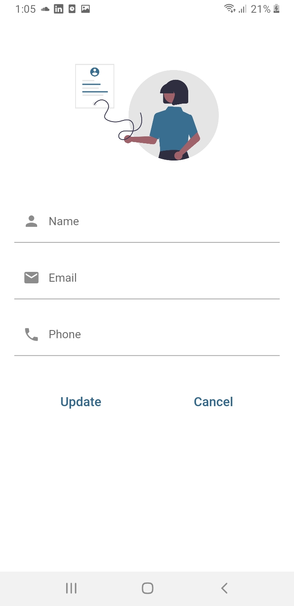

# Shopping App - Flutter Using Bloc 

#
#

| on boarding 1   | on boarding 2     | on boarding 3 |
| -------------- | -------------- | -------------- |
| 
  
 | 
  
 |
  
 |

#
#

| sign in     | Register |
| -------------- | -------------- |
| 
  
 | 
  
 |

#
#

| Home screen   | Profile     | Udpate informations |
| -------------- | -------------- | -------------- |
| 
  
 | 
  
 |
  
 |

#
#

| Search screen   | Details     | favorites |
| -------------- | -------------- | -------------- |
| 
  
 | 
  
 |
  
 |
